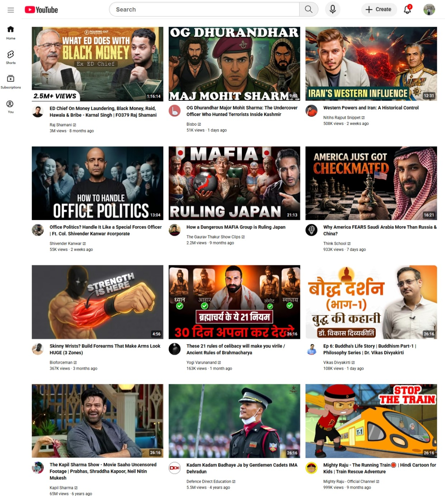

# 📺 YouTube Clone

A front-end clone of YouTube's UI built using **HTML** and **CSS**.  
This project focuses on practicing core CSS layout techniques including Flexbox, Grid, and Positioning.

---

## 🚀 Live Demo

> _Add your GitHub Pages or deployment link here_

---

## 📸 Screenshot



---

## 🛠️ Built With

- HTML5
- CSS3
  - Flexbox
  - CSS Grid
  - Position (fixed, absolute, relative)

---

## 📁 Project Structure
```
youtube-clone/
│
├── youtube.html       # Main YouTube clone page
├── flexbox.html       # Flexbox practice
├── grid.html          # CSS Grid practice
├── position.html      # CSS Positioning practice
└── README.md
```

---

## 📚 Concepts Practiced

| Concept | File |
|---|---|
| Flexbox layout | `flexbox.html` |
| CSS Grid layout | `grid.html` |
| Fixed / Absolute / Relative positioning | `position.html` |
| Full page clone | `youtube.html` |

---

## 🎯 What I Learned

- How to use **Flexbox** for row/column layouts and alignment
- How to use **CSS Grid** with `fr` units, gaps, and multi-column layouts
- How to use **position: fixed** for headers and sidebars
- How to use **position: absolute** relative to a parent container

---

## 👤 Author

**Anant Kumar Agarwal**  
B.Tech CSE | Roorkee Institute of Technology  
[GitHub](https://github.com/anant1307)

---

## 📄 License

This project is licensed under the [MIT License](LICENSE).
